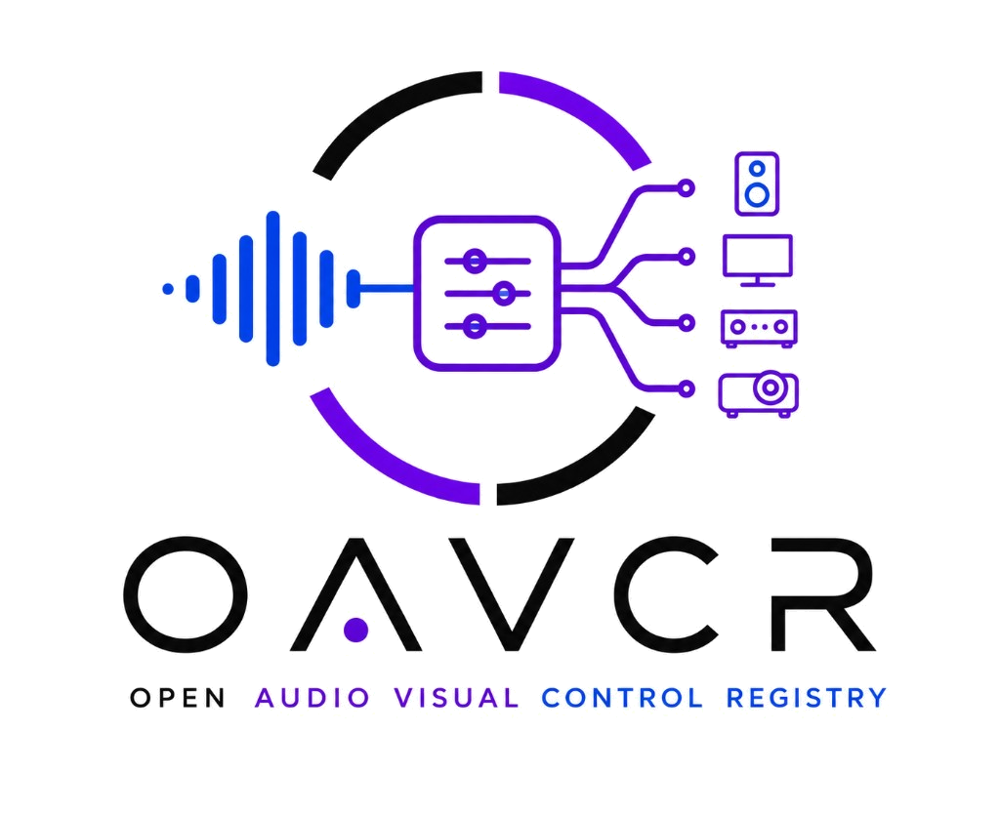

<p align="center">
  
</p>

# OAVCR — Open Audio Visual Control Registry

**An open, community-maintained standard and device registry for controlling
audio and visual equipment over RS-232, infrared, IP, triggers, and more.**

OAVCR records *facts* about real hardware: which transports a product exposes,
how to open the port, and what bytes or IR codes to send for power, volume,
inputs, and transport control. Controllers implement each transport once; every
device in the registry is data.

| Layer | Name |
|---|---|
| **Project** | OAVCR — Open Audio Visual Control Registry |
| **Schema** | [OAVCR Control Specification (OCS)](spec/oavcr-1.1.schema.json) |
| **Database** | OAVCR Device Registry (`registry/devices/*.json`) |
| **Reference UI** | [oavcr.lyr.app](https://oavcr.lyr.app) (directory + device pages) |
| **First consumer** | [Lyr Link](https://lyr.app) — Lyr's physical chain control |

## Why this exists

Most high-end AV gear still ships with RS-232 or IR even when it has no app.
Integrators re-type the same command tables into Crestron, Control4, and Savant
drivers. OAVCR is the neutral layer: one JSON file per product, validated against
a published schema, with a **source URL on every command** so anyone can audit
where an encoding came from.

A **driver** in OAVCR is not code — it is a single JSON file. No plugins, no
compile step, no vendor lock-in.

## Layout

```
spec/              OCS JSON Schema + action/transport/category docs
registry/
  index.json       catalogue
  devices/         one JSON file per product (= the driver)
scripts/           validate.mjs — dependency-free CI gate
drivers/           shared transport helpers (future)
assets/            project logo
```

## Quick start

```bash
node scripts/validate.mjs          # validate every registry entry
```

Inside the Lyr app monorepo (private):

```bash
npm run oavcr:validate
npm run oavcr:build-site             # regenerate oavcr.lyr.app data
```

## Contributing a device

1. Add `registry/devices/<id>.json` matching `spec/oavcr-1.1.schema.json`
2. Add one line to `registry/index.json`
3. Run `node scripts/validate.mjs`

Every control needs a `source` URL (manufacturer manual or bulletin).
`verified: true` means **you sent it to the device** — not that you read it in a
PDF. Devices with only a 12 V trigger get `controlOptions` instead of `controls`.

See **[CONTRIBUTING.md](CONTRIBUTING.md)** for the full walkthrough and import
policy ([SOURCES.md](spec/SOURCES.md)).

## Licence

MIT — schema and registry JSON in this repository.
